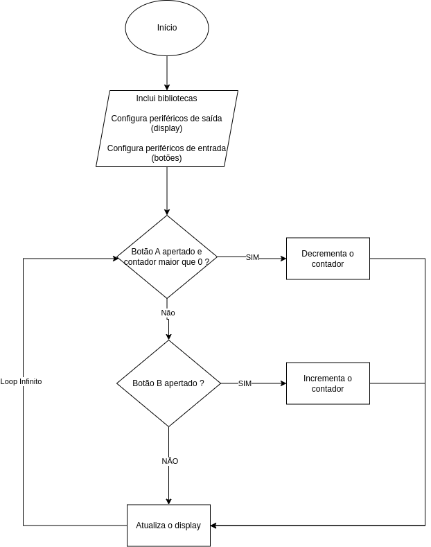

# PROJETO FINAL - CURSO EMBARCATECH

## Descrição
Este projeto implementa um contador utilizando a placa Raspberry Pi Pico W com a placa BitDog Lab, um display OLED SSD1306 via comunicação I2C e dois botões. Os botões são usados para controlar o contador, ao clicar no botão B o contador deve incrementar e ao clicar no botão A o contador deve decrementar, somente números positivos serão mostrados então caso o contador seja igual a zero não será possível decrementar novamente, o contador será exibido no display OLED.

## Componentes Utilizados
- Raspberry Pi Pico W
- Placa BitDog Lab
- Display OLED SSD1306 (I2C)
- Dois botões (push-buttons)
- Resistores pull-up internos ativados

## Conexões
| Componente | Pino Pico |
|------------|----------|
| Display OLED (SDA) | GPIO15 |
| Display OLED (SCL) | GPIO14 |
| Botão A | GPIO5 |
| Botão B | GPIO6 |

## Dependências
Este projeto utiliza as bibliotecas:
- **pico/stdlib.h**: Para funções básicas da Raspberry Pi Pico.
- **hardware/gpio.h**: Para manipulação dos pinos GPIO.
- **hardware/i2c.h**: Para comunicação via I2C com o display OLED.
- **ssd1306.h** e **ssd1306_i2c.h**: Para interação com o display OLED SSD1306.

## Estrutura do Código
O projeto é dividido nas seguintes seções:
- **Inicialização de periféricos**: Configura os botões e o display OLED.
- **Leitura dos botões**: Verifica se os botões foram pressionados e altera o contador.
- **Atualização do display**: Mostra o valor atualizado do contador no display OLED.
- **Loop principal**: Executa continuamente a leitura dos botões e a atualização do display.

## Fluxograma

## Funções Principais

### `void init_botoes()`
Inicializa os botões definindo-os como entrada e ativando resistores pull-up.

### `void botao_clicou()`
Verifica o estado dos botões:
- Botão A decrementa o contador (caso seja maior que zero).
- Botão B incrementa o contador.
- Um pequeno delay (200ms) é aplicado para debounce.

### `void atualiza_tela()`
- Cria um buffer para armazenar os dados do display.
- Converte o valor do contador em string e grava no buffer.
- Renderiza o buffer no display OLED.

### `int main()`
- Inicializa a comunicação I2C e o display OLED.
- Entra em um loop infinito verificando os botões e atualizando o display.

## Como Compilar e Executar
1. Configurar o ambiente de desenvolvimento para Raspberry Pi Pico.
2. Compilar o código utilizando o CMake.
3. Transferir o arquivo `.uf2` para a Pico.

## Conclusão
Este projeto demonstra como utilizar a Raspberry Pi Pico W para criar uma interface simples com botões e um display OLED.

